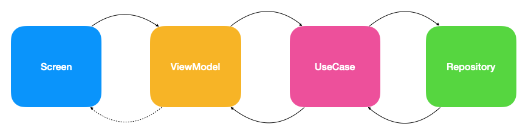
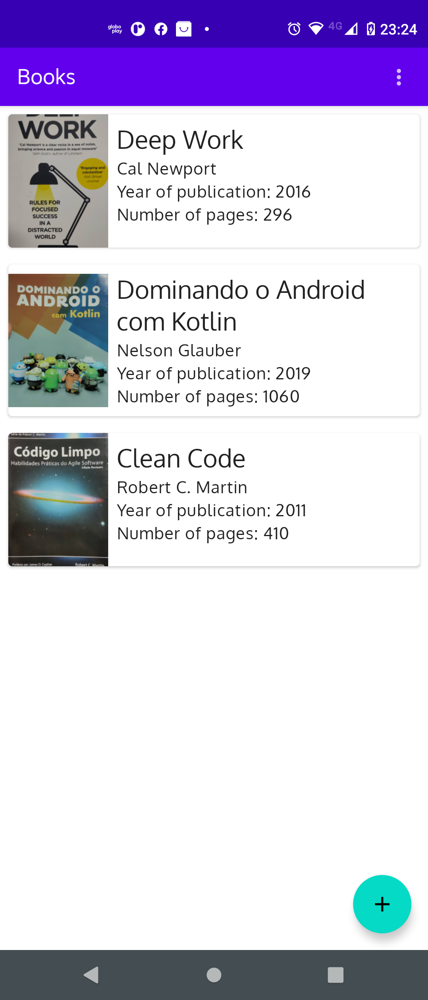
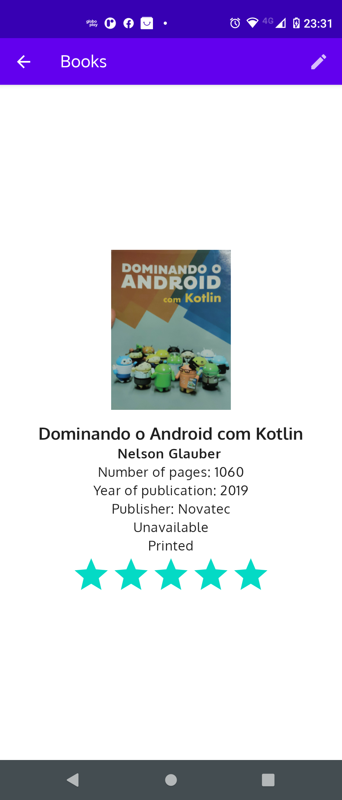
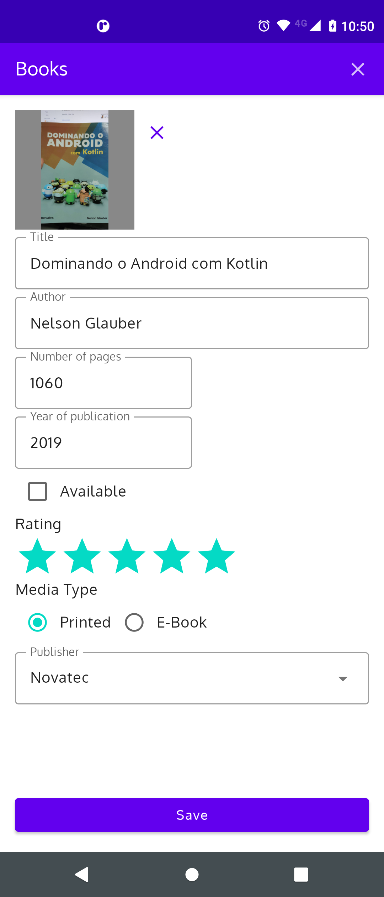

# Books Compose

This sample demonstrates how to use some of the Android Architecture Components available
in  [Jetpack library](https://developer.android.com/jetpack/).

I tried to follow the principles
of [Clean Architecture](https://8thlight.com/blog/uncle-bob/2012/08/13/the-clean-architecture.html)
and use some cool Android libraries. The UI is implemented
using [Jetpack Compose](https://developer.android.com/jetpack/compose)
and [MVVM pattern](https://en.wikipedia.org/wiki/Model%E2%80%93view%E2%80%93viewmodel). Application
data can be persisted either locally into device (using [SQLite](https://www.sqlite.org/index.html))
or remotely (using [Firebase](https://firebase.google.com/)).

The Application is splitted in modules as explained below:

* __app__ - it's the application start point and it has access to all other project's modules.
  Therefore [Hilt](https://developer.android.com/training/dependency-injection/hilt-android) modules
  are defined to inject the required dependencies to the application classes.<br/>
  The navigation logic is implemented
  using [Jetpack Navigation for Compose](https://developer.android.com/jetpack/compose/navigation)
  in order to follow the "single-activity" approach, thus to navigate between application's
  features, the main navigator is defined here and used by the `MainActivity`. The navigation
  between the screens in a module is implemented in each module. <br/>
* __core__ - is a pure Kotlin module and contains core classes used across the whole app
  like: `ResultState` which represent a result for a request to a repository; `AppRoutes` which is a
  generic definition of a route to a screen; etc.
* __core_android__ - contains core resources, components and classes which depend on Android
  framework and/or libraries. For instance: reusable Compose components; styles and themes; file
  system related classes.
* __data_firebase__ - this module has an implementation of a remote data source
  using [Firebase Cloud Firestore](https://firebase.google.com/docs/firestore) and in order to store
  book's covers, [Firebase Cloud Storage](https://firebase.google.com/docs/storage) is used.
* __data_local__ - defines an implementation of a local data source
  using [Room library](https://developer.android.com/topic/libraries/architecture/room). The book's
  cover are stored in the local file system.
* __domain__ - this module is where the application's use cases are declared. The interfaces for
  repositories are also declared here, but the implementation itself is in *data_local* and/or *
  data_firebase* modules. Finally, here is where the navigation abstraction is defined via `Router`
  interface.
* __feature/login__ - under "features" folder are defined all application's features. Login feature
  is where authentication process is implemented
  using [Firebase Authentication](https://firebase.google.com/docs/auth). The UI for the login is
  also defined here.<br/>
* __feature/books__ - this is the main application module, where the books are created, read,
  updated and deleted. Since this project is following (or trying to)
  the [MVVM pattern](https://en.wikipedia.org/wiki/Model%E2%80%93view%E2%80%93viewmodel), this
  module is using [View Model](https://developer.android.com/topic/libraries/architecture/viewmodel)
  library to keep data across config changes.<br/>
  To expose observable data from the View Models, this module is
  using [`StateFlow`](https://developer.android.com/kotlin/flow/stateflow-and-sharedflow) which are
  observed by the screens.<br/>
* __feature/settings__ - this module define a simple application settings which allows the user to
  set the application's theme (light mode, dark mode or follow system preferences)

The architecture data flow is displayed below:<p/>
<br/>

Basically, the repository is responsible to save and restore data. This data are provided
via [`Flow`](https://developer.android.com/kotlin/flow). <br/>
A use case is responsible to perform business validations and acts like a reusable bridge between
view models and repositories. View models will keep the UI state and expose this state to the
screens (via `StateFlow`). When a user do some action, the view model handles this action and change
its internal state, since the screen is observing this state, it should react accordingly. <br/>
Finally, screens are composable components which send actions to the view model and observe the
changes on their state.

## Screenshots

### Books List

This screen displays all books saved on the repository (local or remote).



### Book details

This screen display the details of a book selected in books list.



### Book Form

In this screen, the user can add a new book or edit an existing one.



### Login Screen

The user must perform the login with their Google account to access the application.


## Libraries

This project is written in Kotlin and it's using the following libraries:

* Jetpack Compose core libraries;
* Material Design libraries;
* [Jetpack Libraries](https://developer.android.com/jetpack/) (KTX, Exif, Hilt, Navigation, View
  Model and Room);
* [Compose Accompanist Libraries](https://github.com/google/accompanist) (Navigation and Swipe to
  Refresh)
* [Firebase Libraries for Android](https://firebase.google.com/docs/android/setup) (Authentication,
  Firestore and Storage);
* [Coil Image](https://coil-kt.github.io/coil/compose/) for image loading;
* [Reveal Swipe](https://github.com/ch4rl3x/RevealSwipe);
* [Coroutines](https://github.com/Kotlin/kotlinx.coroutines)
* JUnit
* [MockK](https://github.com/mockk/mockk)

## Get started

The project is compatible with Android Studio Dolphin | 2021.3.1 Canary 3. To run this application,
you must have to [create a Firebase Project](https://firebase.google.com/docs/android/setup)
and [enable Google Authentication](https://firebase.google.com/docs/auth/android/google-signin).
Afterwards, you must have to download the `google_services.json` file from the firebase console and
add it to `app` module root folder. If you want to save data on Firebase Cloud
Firestore, [enable a database](https://firebase.google.com/docs/firestore/quickstart) for your
project in Firebase Console.
Also [enable the Firebase Cloud Storage](https://firebase.google.com/docs/storage/android/start) to
store the books cover images.

To choose the data source you will save application data, just make the following change in
the [RepositoryModule.kt](./app/src/main/java/com/nglauber/architecture_sample/di/RepositoryModule.kt)
file.

```kotlin
@Provides
fun providesBookRepository(
    @ApplicationContext context: Context
): BooksRepository {
    // For local repository use this line
    return RoomLocalRepository(context, LocalFileHelper())
    // For firebase repository use this line
    return FirebaseBookRepository()
}
```

And that's it! You're good to go.

## Contribute ;)

This project is just a sample, but any feedback and/or PR's are really appreciated! :)